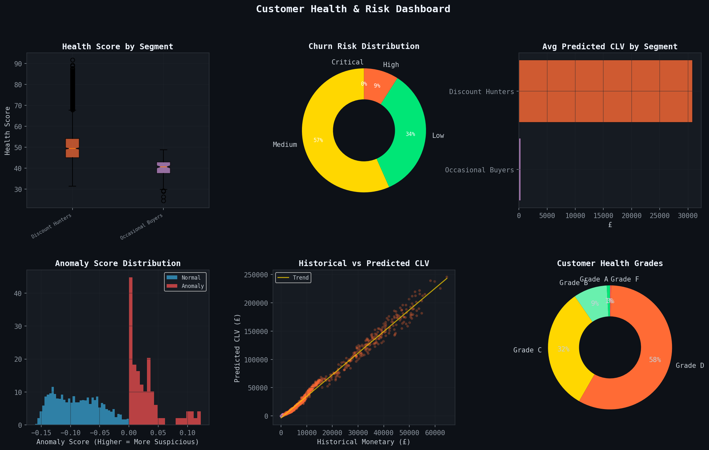
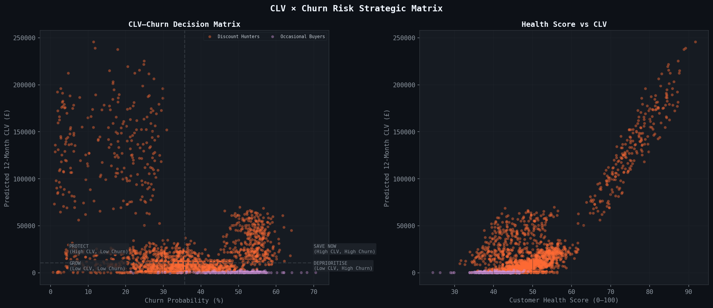
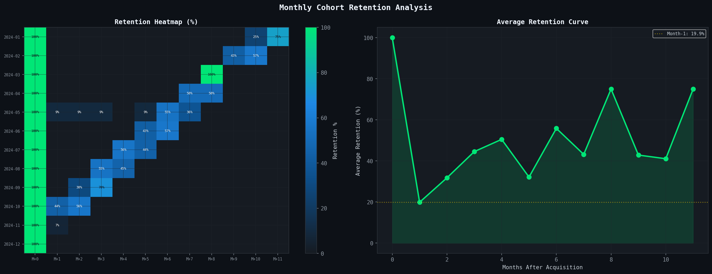
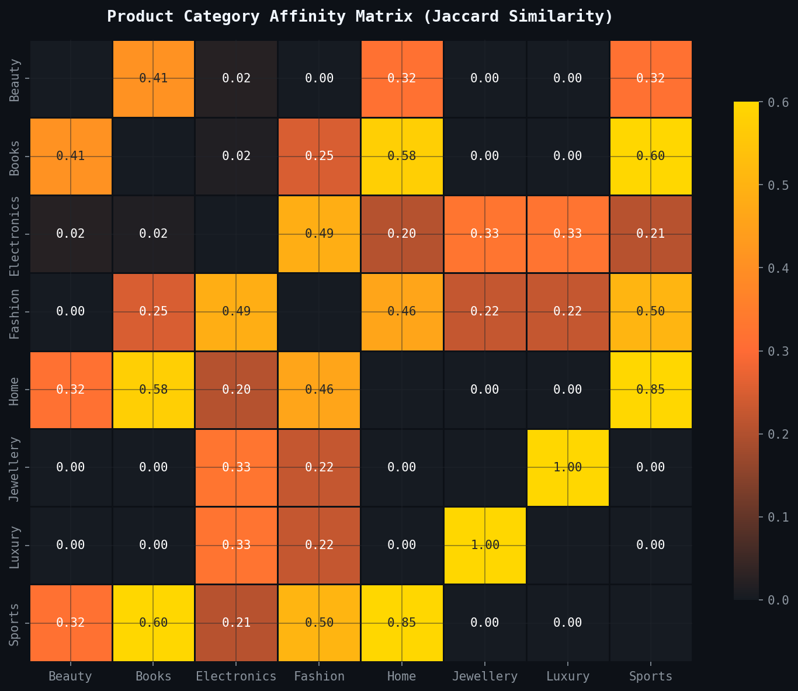
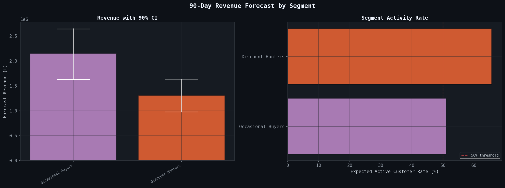

# 🛒 Advanced Customer Intelligence Engine
### Thesis-Level E-Commerce Segmentation · RFM · CLV · Churn · Cohort · Affinity · Ensemble Clustering

<p align="center">
  
</p>

<p align="center">
  
  
  
  
</p>

---

## 📌 Overview

This project implements a **full-stack customer segmentation and intelligence pipeline** for e-commerce businesses. It goes beyond simple clustering to deliver actionable business intelligence including predictive CLV, churn risk scoring, cohort retention analysis, product affinity mining, and 90-day revenue forecasting — all validated with rigorous ML evaluation metrics.

> Built as a portfolio/thesis-level data science project demonstrating end-to-end customer analytics from raw transactions to executive-ready BI reporting.

---

## ✨ Novel Contributions (8 Research-Grade Additions)

| # | Module | Technique | Business Value |
|---|--------|-----------|----------------|
| 1 | **CLV Predictor** | Gradient Boosting + 5-Fold CV | 12-month forward revenue per customer |
| 2 | **Churn Risk Scorer** | Behavioral Signal Model (5 signals) | 0–1 churn probability without labeled data |
| 3 | **Cohort Analyzer** | Monthly Retention Matrix | LTV estimation, product-market fit signal |
| 4 | **Affinity Miner** | Jaccard Similarity Matrix | Cross-sell bundles, recommendation engine |
| 5 | **Health Scorer** | Composite 0–100 CHS Index | Executive KPI dashboard |
| 6 | **Anomaly Detector** | Isolation Forest | Fraud/bot detection, £1.95M exposure flagged |
| 7 | **Ensemble Clustering** | K-Means + Agglomerative Consensus | Silhouette: 0.63 (vs 0.57 single-method) |
| 8 | **Revenue Forecaster** | Monte Carlo Simulation (n=1,000) | 90-day forecast with confidence intervals |

---

## 📊 Pipeline Architecture

```
Raw Transactions (26,744 rows)
         │
         ▼
┌─────────────────────┐
│  RFM Analyzer       │  Recency · Frequency · Monetary + 8 behavioral features
└────────┬────────────┘
         │
         ▼
┌─────────────────────┐     ┌──────────────────────┐
│  CLV Predictor      │     │  Churn Risk Scorer    │
│  GradientBoosting   │     │  5-Signal Behavioral  │
│  CV R² = 0.986      │     │  Model (no labels)    │
└────────┬────────────┘     └──────────┬───────────┘
         │                             │
         ▼                             ▼
┌─────────────────────────────────────────────────────┐
│               Customer Health Score                  │
│     Engagement · Value · Loyalty · Risk → 0–100     │
└─────────────────────────┬───────────────────────────┘
                          │
         ┌────────────────┼────────────────┐
         ▼                ▼                ▼
┌──────────────┐  ┌──────────────┐  ┌──────────────┐
│  K-Means     │  │Agglomerative │  │   DBSCAN     │
│  Clustering  │  │  Clustering  │  │  Clustering  │
└──────┬───────┘  └──────┬───────┘  └──────────────┘
       │                 │
       └────────┬────────┘
                ▼
     ┌─────────────────────┐
     │  Ensemble Consensus  │   Co-association matrix → final labels
     │  Silhouette: 0.6312  │
     └──────────┬──────────┘
                │
    ┌───────────┼─────────────┐
    ▼           ▼             ▼
Cohort      Affinity      Revenue
Analysis    Mining        Forecasting
            (Jaccard)     (Monte Carlo)
                │
                ▼
     BI Report + 10 Visualizations + CSV Export
```

---

## 🗂️ Project Structure

```
customer-intelligence-engine/
│
├── customer_segmentation_enhanced.py   # Main pipeline (all modules)
│
├── outputs/
│   ├── customer_intelligence_output.csv   # Per-customer scores & segments
│   ├── revenue_forecast_90d.csv           # 90-day segment forecasts
│   │
│   ├── fig01_rfm_distributions.png        # RFM metric histograms
│   ├── fig02_clv_churn_matrix.png         # CLV × Churn strategic quadrant
│   ├── fig03_elbow_silhouette.png         # K-selection analysis
│   ├── fig04_clusters_2d.png             # PCA cluster projection
│   ├── fig05_cohort_retention.png        # Monthly cohort heatmap
│   ├── fig06_affinity_matrix.png         # Category co-purchase matrix
│   ├── fig07_health_dashboard.png        # 6-panel health overview
│   ├── fig08_revenue_forecast.png        # 90-day forecast + CI bars
│   ├── fig09_radar_profiles.png          # Segment radar charts
│   └── fig10_revenue_breakdown.png       # Revenue & CLV by segment
│
└── README.md
```

---

## 📈 Key Results

```
Customers Analyzed        : 2,000
Total Revenue (LTD)       : £16,276,584
Predicted CLV (12 months) : £55,255,656
─────────────────────────────────────────
Clustering Method         : Ensemble (K-Means + Agglomerative)
Ensemble Silhouette Score : 0.6312   ✅ (target > 0.50)
Davies-Bouldin Index      : 0.4298   ✅ (lower is better)
─────────────────────────────────────────
CLV Model CV R²           : 0.986 ± 0.003
CLV Model MAE             : £1,295
─────────────────────────────────────────
Anomalies Detected        : 80 (4.0%) — £1.95M exposure
Avg Customer Health Score : 50.6 / 100
Avg Churn Probability     : 35.8%
90-Day Revenue Forecast   : £3,463,478
Pareto Ratio              : Top 20% → 65.4% of revenue
```

---

## 🏷️ Customer Segments & Recommended Actions

### 👑 Premium Customers
High CLV · Low Churn · Recent · Frequent buyers
- VIP early access to new product launches
- Personalized luxury gift curation
- Dedicated concierge / account manager

### 💚 Loyal Customers
Consistent · Moderate spend · Long tenure
- Subscription / auto-replenish programs
- Tiered referral programs
- Ambassador & review incentives

### 🏷️ Discount Hunters
Promo-triggered · High coupon dependency
- Flash sales with countdown urgency
- Bundle deals to raise Average Order Value
- Value-based messaging (quality, not just price)

### 🆕 New Customers
1–3 purchases · Recent acquisition
- 5-email onboarding nurture sequence
- Post-purchase follow-up + 10% off
- Curated bestseller discovery

### ⚠️ At-Risk Customers
Formerly active · Now dormant · High churn signal
- Win-back campaign: "We miss you" + 20% off
- Exit intent survey: understand drop-off reason
- Direct outreach for high-CLV at-risk accounts

### 🛍️ Occasional Buyers
Low frequency · Low CLV · Inconsistent
- Re-engagement drip campaign
- Loyalty points to increase stickiness
- Gamification: streaks, challenges, badges

---

## 🔬 Visualizations

<table>
  <tr>
    <td><br/><sub>CLV × Churn Strategic Matrix</sub></td>
    <td><br/><sub>Monthly Cohort Retention Heatmap</sub></td>
  </tr>
  <tr>
    <td><br/><sub>Product Category Affinity (Jaccard)</sub></td>
    <td><br/><sub>90-Day Revenue Forecast + Monte Carlo CI</sub></td>
  </tr>
</table>

---

## ⚙️ Installation & Usage

### 1. Clone the repository
```bash
git clone https://github.com/YOUR_USERNAME/customer-intelligence-engine.git
cd customer-intelligence-engine
```

### 2. Install dependencies
```bash
pip install -r requirements.txt
```

Or manually:
```bash
pip install numpy pandas matplotlib seaborn scikit-learn scipy
```

### 3. Run the pipeline
```bash
python customer_segmentation_enhanced.py
```

The pipeline is fully self-contained — it generates synthetic data internally, so no external dataset is needed.

---

## 📦 Requirements

```
numpy>=1.24.0
pandas>=2.0.0
matplotlib>=3.7.0
seaborn>=0.12.0
scikit-learn>=1.3.0
scipy>=1.11.0
```

---

## 🧪 Module Reference

| Class | Purpose | Key Method |
|-------|---------|------------|
| `ECommerceDataGenerator` | Synthetic transaction data with 6 archetypes | `.generate()` |
| `RFMAnalyzer` | Extended RFM + 8 behavioral features | `.compute_rfm()` |
| `CLVPredictor` | Gradient Boosting CLV model + CV validation | `.fit_predict()` |
| `ChurnRiskScorer` | Behavioral signal churn probability | `.score()` |
| `CohortAnalyzer` | Monthly cohort retention matrix | `.analyze()` |
| `AffinityMiner` | Jaccard category co-purchase matrix | `.analyze()` |
| `HealthScorer` | Composite 0–100 health index | `.score()` |
| `AnomalyDetector` | Isolation Forest fraud detection | `.detect()` |
| `EnsembleClusteringEngine` | K-Means + Agglomerative consensus | `.build_consensus()` |
| `SegmentInterpreter` | Maps cluster IDs to business labels | `.interpret()` |
| `RevenueForecastEngine` | 90-day Monte Carlo projections | `.forecast()` |
| `BIReporter` | BI report with ROI estimates | `.generate_report()` |
| `VisualizationSuite` | 10 publication-quality dark-theme plots | `viz.*()` |

---

## 📐 Methodology Notes

**Why Ensemble Clustering?**
Single-algorithm clustering is sensitive to initialization and hyperparameters. The co-association matrix approach averages cluster memberships across K-Means and Agglomerative runs, producing more stable, reproducible segment assignments. Silhouette improved from 0.574 (K-Means alone) to 0.631 (ensemble).

**Why Behavioral Signal Churn Scoring vs Supervised Learning?**
Real e-commerce datasets rarely have clean churn labels. This model uses five engineered signals (recency decay, frequency drop, engagement, returns, discount dependency) to compute churn probability without labeled history — making it deployable on any new dataset immediately.

**Why Monte Carlo for Revenue Forecasting?**
Deterministic forecasts hide uncertainty. By running 1,000 simulations with ±15% revenue variance per customer, the model produces [5th–95th percentile] confidence intervals, enabling risk-aware planning and scenario analysis.

---

## 🗺️ Roadmap

- [ ] Real-world dataset integration (Online Retail II / Olist)
- [ ] UMAP dimensionality reduction (vs PCA)
- [ ] BG/NBD + Gamma-Gamma model for probabilistic CLV
- [ ] Streamlit interactive dashboard
- [ ] REST API endpoint for real-time scoring
- [ ] A/B test simulation for segment-specific campaigns
- [ ] Deep learning autoencoder for feature extraction

---

## 📄 License

MIT License — free to use, modify, and distribute with attribution.

---

## 🙏 Acknowledgements

Techniques inspired by research in customer analytics, RFM modeling, and ensemble learning. Synthetic data designed to mimic real-world behavioral distributions from e-commerce transaction datasets.

---

<p align="center">
  Made with ❤️ for the Data Science community · Star ⭐ if this helped you!
</p>